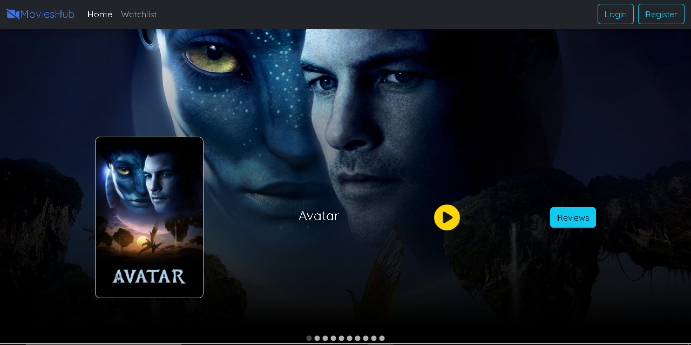

   </a>

<h1 align="center">MoviesHub Website</h1>

     <h4 align="center">
       This website is for avid movie enthusiasts who enjoy watching and providing reviews for films.
     </h4>
      
      

-----------------------------------------
### Overview

-----------------------------------------

### Features

* User-friendly interface with easier navigation between movies
* Click on movies to watch trailer
* Post reviews for each movie
* User authentication for secure posting of reviews

-----------------------------------------

### Implementation
* Built with React for the front-end, utilizing Spring Boot (Java Framework) for the server-side logic, and integrated with a MongoDB database for data management.
* Created a dynamic Home page that aggregates and displays all movies using React Carousel.
* Implemented a feature such that users can watch trailer and add reviews for each movie
* Added user authentication using JSON Web Tokens (JWT)

-----------------------------------------

### Screenshots
* `Home Page`
  

 

 

* `Trailer Page`
  

 

 

* `Reviews Page`
  

 

